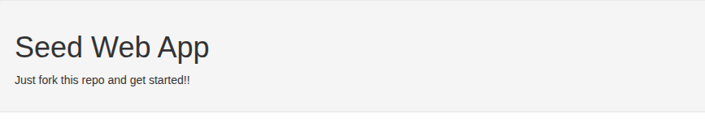

### Demo simplest GWT + Bootstrap3

Used Java 8 !!!:

````shell
export JAVA_HOME=/usr/lib/jvm/java-8-openjdk-amd64
````

Generate wrapper:

````shell
mvn -N wrapper:wrapper
````

Package project:

````shell
./mvnw package
````

Start project:

````shell
export JAVA_HOME=/usr/lib/jvm/java-8-openjdk-amd64

./mvnw gwt:run
````

[http://127.0.0.1:8888/SeedWebApp.html](http://127.0.0.1:8888/SeedWebApp.html)



Demo __link__ Bootstrap in [SeedWebApp.ui.xml](src/main/java/org/gwtbootstrap3/seed/client/SeedWebApp.ui.xml). 
Used tag __"b"__ for Bootstrap (see in xmlns:b.html='urn:import:org.gwtbootstrap3.client.ui.html' in [SeedWebApp.ui.xml](src/main/java/org/gwtbootstrap3/seed/client/SeedWebApp.ui.xml)):

````html
    <b.html:Div>
        <b:Well>
            <b:Heading size="H1" text="Seed Web App" />
            <b.html:Paragraph>Just fork this repo and get started!!</b.html:Paragraph>
        </b:Well>
    </b.html:Div>
````

translated to:

````html
<div>                                                // --> <b.html:Div>
    <div class="well">                               // -->   <b:Well>
        <h1>Seed Web App</h1>                        // -->     <b:Heading size="H1" text="Seed Web App" />
        <p>Just fork this repo and get started!!</p> // -->     <b.html:Paragraph>Just fork this repo and get started!!</b.html:Paragraph>
    </div>                                           // -->   </b:Well>
</div>                                               // --> </b.html:Div>
````

## Seed Web App For GwtBootstrap3

Starter project with everything you need to start a GwtBootstrap3 and GWT project.

This project can be run using Maven http://maven.apache.org

`mvn gwt:run`


Enjoy!
